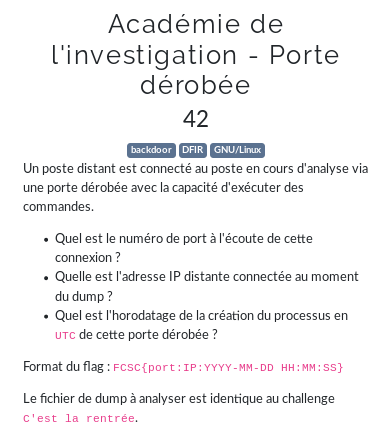

# Académie de l'investigation - Porte dérobée



```bash
$ volatility -f dmp.mem --profile=LinuxKali2020x64 linux_netstat | grep ESTABLISHED
Volatility Foundation Volatility Framework 2.6
TCP      10.42.42.131    :36970 116.203.52.118  :  443 ESTABLISHED                   tor/706  
TCP      10.42.42.131    :37252 163.172.182.147 :  443 ESTABLISHED                   tor/706  
TCP      fd:6663:7363:1000:c10b:6374:25f:dc37:36280 fd:6663:7363:1000:55cf:b9c6:f41d:cc24:58014 ESTABLISHED                  ncat/1515 
TCP      10.42.42.131    :47106 216.58.206.226  :  443 ESTABLISHED              chromium/119187
TCP      10.42.42.131    :55224 151.101.121.140 :  443 ESTABLISHED              chromium/119187
TCP      10.42.42.131    :55226 151.101.121.140 :  443 ESTABLISHED              chromium/119187
TCP      10.42.42.131    :53190 104.124.192.89  :  443 ESTABLISHED              chromium/119187
TCP      10.42.42.131    :45652 35.190.72.21    :  443 ESTABLISHED              chromium/119187
TCP      10.42.42.131    :47102 216.58.206.226  :  443 ESTABLISHED              chromium/119187
TCP      10.42.42.131    :47104 216.58.206.226  :  443 ESTABLISHED              chromium/119187
TCP      10.42.42.131    :38186 216.58.213.142  :  443 ESTABLISHED              chromium/119187
TCP      10.42.42.131    :47100 216.58.206.226  :  443 ESTABLISHED              chromium/119187
TCP      10.42.42.131    :50612 104.93.255.199  :  443 ESTABLISHED              chromium/119187
TCP      10.42.42.131    :58772 185.199.111.154 :  443 ESTABLISHED              chromium/119187
TCP      10.42.42.131    :38184 216.58.213.142  :  443 ESTABLISHED              chromium/119187
TCP      10.42.42.131    :57000 10.42.42.134    :   22 ESTABLISHED                   ssh/119468
TCP      fd:6663:7363:1000:c10b:6374:25f:dc37:36280 fd:6663:7363:1000:55cf:b9c6:f41d:cc24:58014 ESTABLISHED                    sh/119511
TCP      127.0.0.1       :38498 127.0.0.1       :34243 ESTABLISHED                   cli/119514
TCP      127.0.0.1       :34243 127.0.0.1       :38498 ESTABLISHED                   cli/119514
TCP      10.42.42.131    :51858 10.42.42.128    :  445 ESTABLISHED             smbclient/119577
$ volatility -f dmp.mem --profile=LinuxKali2020x64 linux_pslist | grep ncat
Volatility Foundation Volatility Framework 2.6
0xffff9d72c014be00 ncat                 1515            1513            1001            1001   0x000000003e3d0000 2020-03-26 23:24:20 UTC+0000
0xffff9d7284928000 ncat                 119711          119707          1001            1001   0x0000000007a54000 2020-03-26 23:36:52 UTC+0000
```

format flag: `FCSC{port:IP:YYYY-MM-DD HH:MM:SS}`
flag: `FCSC{36280:fd:6663:7363:1000:55cf:b9c6:f41d:cc24:2020-03-26 23:24:20}`
