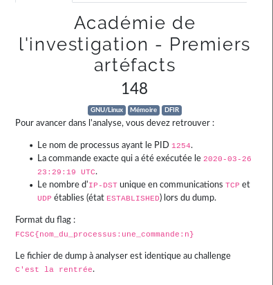

# Académie de l'investigation - Premiers artéfacts



```bash
$ volatility --info | grep linux_ | grep process
Volatility Foundation Volatility Framework 2.6
linux_bash                 - Recover bash history from bash process memory
linux_bash_env             - Recover a process' dynamic environment variables
linux_bash_hash            - Recover bash hash table from bash process memory
linux_check_creds          - Checks if any processes are sharing credential structures
linux_cpuinfo              - Prints info about each active processor
linux_dynamic_env          - Recover a process' dynamic environment variables
linux_elfs                 - Find ELF binaries in process mappings
linux_getcwd               - Lists current working directory of each process
linux_library_list         - Lists libraries loaded into a process
linux_librarydump          - Dumps shared libraries in process memory to disk
linux_malfind              - Looks for suspicious process mappings
linux_pidhashtable         - Enumerates processes through the PID hash table
linux_pkt_queues           - Writes per-process packet queues out to disk
linux_proc_maps            - Gathers process memory maps
linux_proc_maps_rb         - Gathers process maps for linux through the mappings red-black tree
linux_procdump             - Dumps a process's executable image to disk
linux_process_hollow       - Checks for signs of process hollowing
linux_psaux                - Gathers processes along with full command line and start time
linux_psenv                - Gathers processes along with their static environment variables
linux_psscan               - Scan physical memory for processes
linux_pstree               - Shows the parent/child relationship between processes
linux_psxview              - Find hidden processes with various process listings
linux_threads              - Prints threads of processes
$ volatility -f dmp.mem --profile=LinuxKali2020x64 linux_psscan | grep 1254
Volatility Foundation Volatility Framework 2.6
0x000000003fdccd80 pool-xfconfd         1254            -               -1              -1     0x0fd08ee88ee08ec0 -
$ volatility -f dmp.mem --profile=LinuxKali2020x64 linux_bash
Volatility Foundation Volatility Framework 2.6
Pid      Name                 Command Time                   Command
-------- -------------------- ------------------------------ -------
    1523 bash                 2020-03-26 23:24:18 UTC+0000   rm .bash_history 
    1523 bash                 2020-03-26 23:24:18 UTC+0000   exit
    1523 bash                 2020-03-26 23:24:18 UTC+0000   vim /home/Lesage/.bash_history 
    1523 bash                 2020-03-26 23:24:27 UTC+0000   ss -laupt
    1523 bash                 2020-03-26 23:26:06 UTC+0000   rkhunter -c
    1523 bash                 2020-03-26 23:29:19 UTC+0000   nmap -sS -sV 10.42.42.0/24
    1523 bash                 2020-03-26 23:31:31 UTC+0000   ?+??U
    1523 bash                 2020-03-26 23:31:31 UTC+0000   ip -c addr
    1523 bash                 2020-03-26 23:38:00 UTC+0000   swapoff -a
    1523 bash                 2020-03-26 23:38:05 UTC+0000   swapon -a
    1523 bash                 2020-03-26 23:40:18 UTC+0000   ls
    1523 bash                 2020-03-26 23:40:23 UTC+0000   cat LiME.txt 
    1523 bash                 2020-03-26 23:40:33 UTC+0000   cd LiME/src/
    1523 bash                 2020-03-26 23:40:54 UTC+0000   
    1523 bash                 2020-03-26 23:40:54 UTC+0000   insmod lime-5.4.0-4-amd64.ko "path=/dmp.mem format=lime timeout=0"
$ volatility -f dmp.mem --profile=LinuxKali2020x64 linux_netstat | grep ESTABLISHED
Volatility Foundation Volatility Framework 2.6
TCP      10.42.42.131    :36970 116.203.52.118  :  443 ESTABLISHED                   tor/706  
TCP      10.42.42.131    :37252 163.172.182.147 :  443 ESTABLISHED                   tor/706  
TCP      fd:6663:7363:1000:c10b:6374:25f:dc37:36280 fd:6663:7363:1000:55cf:b9c6:f41d:cc24:58014 ESTABLISHED                  ncat/1515 
TCP      10.42.42.131    :47106 216.58.206.226  :  443 ESTABLISHED              chromium/119187
TCP      10.42.42.131    :55224 151.101.121.140 :  443 ESTABLISHED              chromium/119187
TCP      10.42.42.131    :55226 151.101.121.140 :  443 ESTABLISHED              chromium/119187
TCP      10.42.42.131    :53190 104.124.192.89  :  443 ESTABLISHED              chromium/119187
TCP      10.42.42.131    :45652 35.190.72.21    :  443 ESTABLISHED              chromium/119187
TCP      10.42.42.131    :47102 216.58.206.226  :  443 ESTABLISHED              chromium/119187
TCP      10.42.42.131    :47104 216.58.206.226  :  443 ESTABLISHED              chromium/119187
TCP      10.42.42.131    :38186 216.58.213.142  :  443 ESTABLISHED              chromium/119187
TCP      10.42.42.131    :47100 216.58.206.226  :  443 ESTABLISHED              chromium/119187
TCP      10.42.42.131    :50612 104.93.255.199  :  443 ESTABLISHED              chromium/119187
TCP      10.42.42.131    :58772 185.199.111.154 :  443 ESTABLISHED              chromium/119187
TCP      10.42.42.131    :38184 216.58.213.142  :  443 ESTABLISHED              chromium/119187
TCP      10.42.42.131    :57000 10.42.42.134    :   22 ESTABLISHED                   ssh/119468
TCP      fd:6663:7363:1000:c10b:6374:25f:dc37:36280 fd:6663:7363:1000:55cf:b9c6:f41d:cc24:58014 ESTABLISHED                    sh/119511
TCP      127.0.0.1       :38498 127.0.0.1       :34243 ESTABLISHED                   cli/119514
TCP      127.0.0.1       :34243 127.0.0.1       :38498 ESTABLISHED                   cli/119514
TCP      10.42.42.131    :51858 10.42.42.128    :  445 ESTABLISHED             smbclient/119577
$ netstat -tulpn
Active Internet connections (only servers)
Proto Recv-Q Send-Q Local Address           Foreign Address         State       PID/Program name    
$ volatility -f dmp.mem --profile=LinuxKali2020x64 linux_netstat | grep UDP
Volatility Foundation Volatility Framework 2.6
UDP      0.0.0.0         : 5353 0.0.0.0         :    0                      avahi-daemon/633  
UDP      ::              : 5353 ::              :    0                      avahi-daemon/633  
UDP      0.0.0.0         :48868 0.0.0.0         :    0                      avahi-daemon/633  
UDP      ::              :56069 ::              :    0                      avahi-daemon/633  
UDP      10.42.42.131    :   68 10.42.42.254    :   67                    NetworkManager/636  
UDP      ::1             :   53 ::              :    0                           unbound/695  
UDP      127.0.0.1       :   53 0.0.0.0         :    0                           unbound/695  
UDP      224.0.0.251     : 5353 0.0.0.0         :    0                          chromium/119148
$ volatility -f dmp.mem --profile=LinuxKali2020x64 linux_netstat | grep ESTABLISHED | awk '{print $4}' | uniq | grep -v 'ESTABLISHED'
Volatility Foundation Volatility Framework 2.6
116.203.52.118
163.172.182.147
216.58.206.226
151.101.121.140
104.124.192.89
35.190.72.21
216.58.206.226
216.58.213.142
216.58.206.226
104.93.255.199
185.199.111.154
216.58.213.142
10.42.42.134
127.0.0.1
10.42.42.128
$ volatility -f dmp.mem --profile=LinuxKali2020x64 linux_netstat | grep ESTABLISHED | awk '{print $4}' | uniq | grep -v 'ESTABLISHED' | wc -l
Volatility Foundation Volatility Framework 2.6
15
$ volatility -f dmp.mem --profile=LinuxKali2020x64 linux_netstat | grep UDP
Volatility Foundation Volatility Framework 2.6
UDP      0.0.0.0         : 5353 0.0.0.0         :    0                      avahi-daemon/633  
UDP      ::              : 5353 ::              :    0                      avahi-daemon/633  
UDP      0.0.0.0         :48868 0.0.0.0         :    0                      avahi-daemon/633  
UDP      ::              :56069 ::              :    0                      avahi-daemon/633  
UDP      10.42.42.131    :   68 10.42.42.254    :   67                    NetworkManager/636  
UDP      ::1             :   53 ::              :    0                           unbound/695  
UDP      127.0.0.1       :   53 0.0.0.0         :    0                           unbound/695  
UDP      224.0.0.251     : 5353 0.0.0.0         :    0                          chromium/119148
```

> `uniq` n'as pas supp tous les doublons

flag: `FCSC{pool-xfconfd:nmap -sS -sV 10.42.42.0/24:13}`

## Liens utiles

- https://k-lfa.info/volatility-cheatsheet/
- https://github.com/volatilityfoundation/volatility/wiki/Linux-Command-Reference