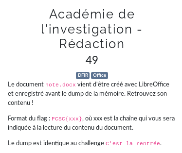
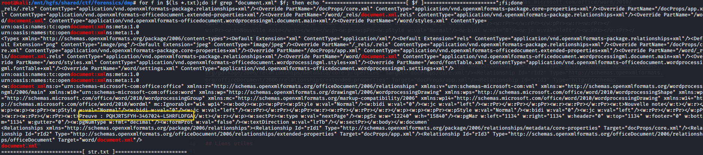

# Académie de l'investigation - Rédaction



```bash
$ volatility -f dmp.mem --profile=LinuxKali2020x64 linux_lsof | grep note
Volatility Foundation Volatility Framework 2.6
0xffff9d72848edd00 soffice.bin                      119615       40 /home/Lesage/Documents/note.docx
$ volatility -f dmp.mem --profile=LinuxKali2020x64 linux_procdump -p 119615 -D recover_filesystem
Volatility Foundation Volatility Framework 2.6
Offset             Name                 Pid             Address            Output File
------------------ -------------------- --------------- ------------------ -----------
0xffff9d72848edd00 soffice.bin          119615          0x000056361a411000 recover_filesystem/sofficebin.119615.0x56361a411000
$ ls -lah recover_filesystem/
total 12K
drwxr-xr-x 1 user user 4.0K May  2 21:57 .
drwxr-xr-x 1 user user 4.0K May  2 21:56 ..
drwxr-xr-x 1 user user 4.0K Apr 30 23:20 dev
-rw-r--r-- 1 user user    0 May  2 21:57 sofficebin.119615.0x56361a411000
$ 
```

Merci a cet [article](https://wiki.fileformat.com/word-processing/docx/):




flag: `FCSC{PQHJRTSFYH-3467024-LSHRFLDFGA}`

## Liens utiles

- https://wiki.fileformat.com/word-processing/docx/
- https://github.com/Sacriyana/CTF-Write-Up/blob/master/ecsc/2019/prequals/3615_incidents/readme.md