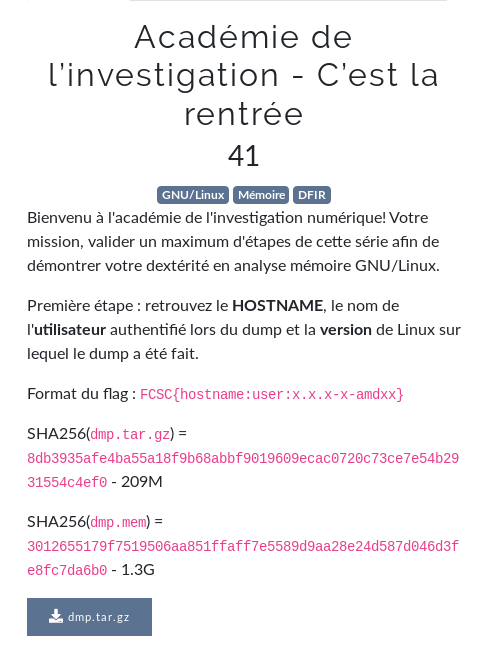

# C’est la rentrée



```bash
$ strings dmp.mem | grep "Linux version" | sort | uniq
Linux version 5.4.0-4-amd64 (debian-kernel@lists.debian.org) (gcc version 9.2.1 20200203 (Debian 9.2.1-28)) #1 SMP Debian 5.4.19-1 (2020-02-13)
$ root@kali:~/Desktop/forensics# strings dmp.mem | grep "LOGNAME" | sort | uniq
fLOGNAME
LOGNAME
LOGNAME=Lesage
LOGNAME=root
...
$ root@kali:~/Desktop/forensics# strings dmp.mem | grep "HOSTNAME" | sort | uniq
HOSTNAME
_HOSTNAME=challenge.fcsc

```

- Format du flag : `FCSC{hostname:user:x.x.x-x-amdxx}`

flag: `FCSC{challenge.fcsc:Lesage:5.4.0-4-amd64}`

## Liens utiles

- https://adel-allam.fr/ctf/2019/07/23/forensic.html