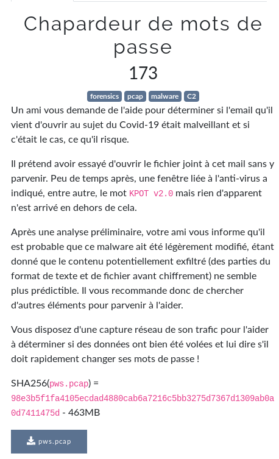

# {NOM_DU_CHALL}



- `http.request.method == POST`

- `http.request.full_uri contains gate.php`

```bash
$ # Try to reproduce example from proofpoint
$ ./xor-files plaintext key > exemple.bin
$ cat exemple.bin | base64
BUEJAHZiRnNGY0NwWXJpe1WgcDV0eAoeKB02fDBvK20dFFW7cTxxfAoMKCMHIhYgHCIGFE2tdTJ6
dBUMKGhZPh0mRGl3P3KLGC9ndhUSNQAyAC0eTSIpO26eQBEdbhgUJQM1EDcTNxxpFFW4ZjF6cwIB
KB1GYkB1NxwdDka2eT1nbiM2BCkDPQIeHDstFFW4ZjF6cwIBKB1dfAY5HG8GFE2tdTJ6dBUMKGcC
IRczGDE2LWOTUVVkdSIgHDYYIi0eLxEYCUi6Zi9nARgMMBA2EDAEOhwGej/Pay98dAsaOg8oDS0e
LAYVAkeyay9nbgMWOws6Hy0eYg=
$ ./xor-files exemple.bin key
1111111111111100__DELIMM__A.B.C.D__DELIMM__appdata__GRABBER__*.log,*.txt,__GRABBER__%appdata%__GRABBER__0__GRABBER__1024__DELIMM__desktop_txt__GRABBER__*.txt,__GRABBER__%userprofile%\Desktop__GRABBER__0__GRABBER__150__DELIMM____DELIMM____DELIMM__
$ # We extract the DATA send by GET
$ cat get.b64 
RHVdQ1V8BFVHAgRSAGNZRisbKDYoBXgpKW0HUgl8WUZMal1HXWIGU0Vtaid0HiE7ORszEhQ8UQUCU2o8dgApNDYBPiw7ZhsIGVUZSR8mEAJYGzM0Ng13JjNgajwUMxgGECUYEkETaiMkc3chdAA3KUQbMzQ2DXcmM2BqPABiWkIrGyg2KAV4KSltUQZCORwZBBsYCxATaiMkc3chdAA3KV5qGAsQYGo7MWB0IXMXOikrYRkAAT5FFhlUXA9UdzQyETcHBws8ajsxYHQhcxc6KSt0MywjHnQmNHdnPG5iNykwASA6KQFqOyltcSZ9GyU7KxszLCAJeS07f2o8
$ cat get.b64 | base64 -d > get.bin
$ # Yes now let's find the key with bruteforce
$ # [...] some tests [...]
$ python brute.py get.bin 
tDlsdL5dv25c1Rhv
__DELIMM__218.108.149.373__DELIMM__appdata__GRABBER__*.log,*.txt,__GRABBER__%appdata%__GRABBER__0__GRABBER__1024__DELIMM__desktop_txt__GRABBER__*.txt,__GRABBER__%userprofile%\Desktop__GRABBER__0__GRABBER__0__DELIMM____DELIMM____DELIMM__
$ # Yes! We found the key: tDlsdL5dv25c1Rhv
```

Now that we found the key `tDlsdL5dv25c1Rhv`, let's extract the POST request's content with **Wireshark**: **`File > Export Objects > HTTP`**. `Text filter: **203.0.113.42**` _(or **gate.php** &rarr; specific to `KPOT v2.0`)_ and the `Save`.

```bash
$ # Now let's
$ python brute.py post.bin 
urQue2M4l!  R4ssur3z-Votre-Am1-Et-vo1c1Votredr4peau_FCSC
{469e8168718996ec83a92acd6fe6b9c03c6ced2a3a7e7a2089b534baae97a7}
_DRAPEAU_
```

flag: `FCSC{469e8168718996ec83a92acd6fe6b9c03c6ced2a3a7e7a2089b534baae97a7}`

## Liens utiles

- https://www.proofpoint.com/us/threat-insight/post/new-kpot-v20-stealer-brings-zero-persistence-and-memory-features-silently-steal
- https://github.com/scangeo/xor-files
- https://unit42.paloaltonetworks.com/using-wireshark-exporting-objects-from-a-pcap/