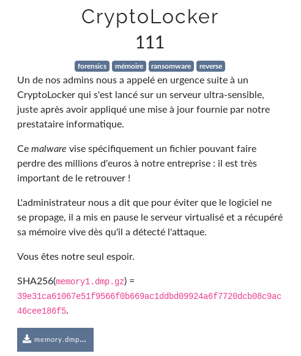
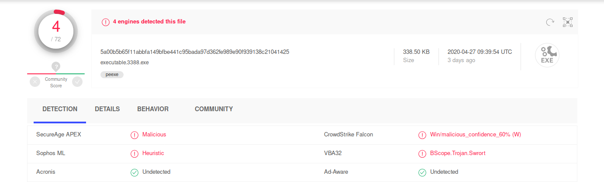
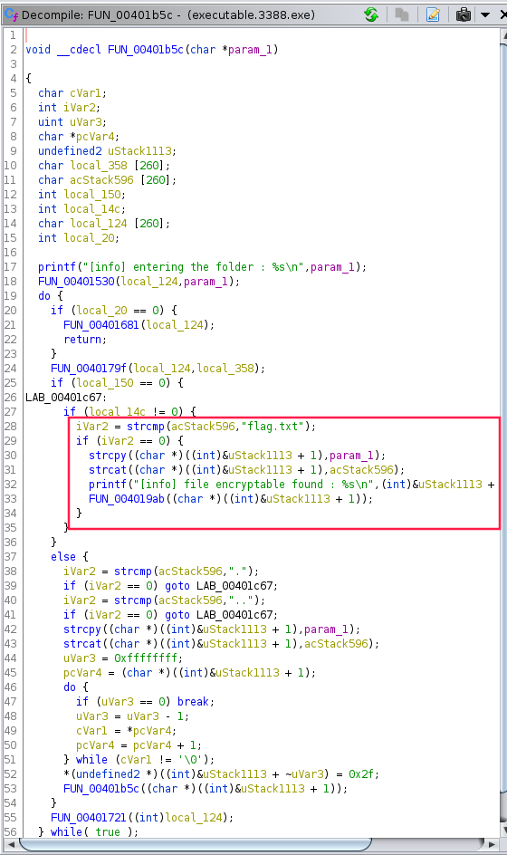
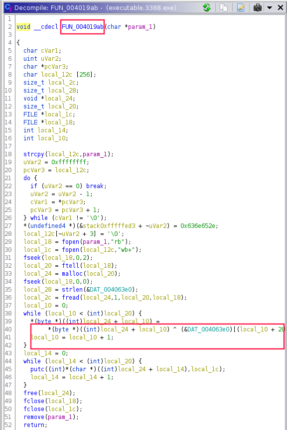

# CryptoLocker



```bash
$ gunzip memory.dmp.gz
$ file memory.dmp 
memory.dmp: MS Windows 32bit crash dump, PAE, full dump, 262030 pages
$ volatility -f memory.dmp imageinfo
Volatility Foundation Volatility Framework 2.6
INFO    : volatility.debug    : Determining profile based on KDBG search...
          Suggested Profile(s) : Win7SP1x86_23418, Win7SP0x86, Win7SP1x86_24000, Win7SP1x86 (Instantiated with WinXPSP2x86)
                     AS Layer1 : IA32PagedMemoryPae (Kernel AS)
                     AS Layer2 : WindowsCrashDumpSpace32 (Unnamed AS)
                     AS Layer3 : FileAddressSpace (/mnt/hgfs/shared/ctf/forensics/mem/memory.dmp)
                      PAE type : PAE
                           DTB : 0x185000L
             KUSER_SHARED_DATA : 0xffdf0000L
           Image date and time : 2020-04-13 18:39:35 UTC+0000
     Image local date and time : 2020-04-13 11:39:35 -0700
$ volatility -f memory.dmp --profile=Win7SP1x86_23418 malfind > malfind.txt
$ volatility -f memory.dmp --profile=Win7SP1x86_23418 pslist > pslist.txt
$ volatility -f memory.dmp --profile=Win7SP1x86_23418 consoles > consoles.txt
$ cat consoles.txt
...
ConsoleProcess: conhost.exe Pid: 3428
Console: 0xbe81c0 CommandHistorySize: 50
HistoryBufferCount: 1 HistoryBufferMax: 4
OriginalTitle: C:\Users\IEUser\Desktop\update_v0.5.exe
Title: C:\Users\IEUser\Desktop\update_v0.5.exe
AttachedProcess: update_v0.5.ex Pid: 3388 Handle: 0x5c
----
CommandHistory: 0x309a78 Application: update_v0.5.exe Flags: Allocated
CommandCount: 0 LastAdded: -1 LastDisplayed: -1
FirstCommand: 0 CommandCountMax: 50
ProcessHandle: 0x5c
----
Screen 0x2f60a0 X:80 Y:300
Dump:
        ENCRYPTOR v0.5                                                          
                                                                                
[info] entering the folder : ./                                                 
[info] file encryptable found : ./flag.txt                                      
                                                                                
****Chiffrement termin??e ! Envoyez l'argent !  
...
$ volatility -f memory.dmp --profile=Win7SP1x86_23418 pslist > pslist.txt
$ volatility -f memory.dmp --profile=Win7SP1x86_23418 filescan > filescan.txt
$ cat filescan.txt | grep flag
0x000000003ed139f0      2      0 RW-rw- \Device\HarddiskVolume1\Users\IEUser\Desktop\flag.txt.enc
$ # Dump flag
$ volatility -f memory.dmp --profile=Win7SP0x86 dumpfiles -D flag/ -Q 0x000000003ed139f0
Volatility Foundation Volatility Framework 2.6
DataSectionObject 0x3ed139f0   None   \Device\HarddiskVolume1\Users\IEUser\Desktop\flag.txt.enc
$ strings 3428.txt | less
...
[info] entering the folder : %s
flag.txt
[info] file encryptable found : %s
	ENCRYPTOR v0.5
key.txt
[error] can't read the key-file :s
...
$ # Dump keys
$ cat filescan.txt | grep key.txt
0x000000003e6fa100      8      0 RW-rw- \Device\HarddiskVolume1\Users\IEUser\Desktop\key.txt
0x000000003ed13898      2      1 R--rw- \Device\HarddiskVolume1\Users\IEUser\Desktop\key.txt
$ mkdir -p keys/key1
$ mkdir -p keys/key2
$ volatility -f memory.dmp --profile=Win7SP0x86 dumpfiles -D keys/key1/ -Q 0x000000003e6fa100
Volatility Foundation Volatility Framework 2.6
DataSectionObject 0x3e6fa100   None   \Device\HarddiskVolume1\Users\IEUser\Desktop\key.txt
SharedCacheMap 0x3e6fa100   None   \Device\HarddiskVolume1\Users\IEUser\Desktop\key.txt
$ volatility -f memory.dmp --profile=Win7SP0x86 dumpfiles -D keys/key2/ -Q 0x000000003ed13898
Volatility Foundation Volatility Framework 2.6
DataSectionObject 0x3ed13898   None   \Device\HarddiskVolume1\Users\IEUser\Desktop\key.txt
SharedCacheMap 0x3ed13898   None   \Device\HarddiskVolume1\Users\IEUser\Desktop\key.txt
$ # Dump exe
$ cat pslist.txt | grep update_v0.5
0x83de43a8 update_v0.5.ex         3388   1432      2       61      1      0 2020-04-13 18:38:00 UTC+0000
$ volatility -f memory.dmp --profile=Win7SP0x86 procdump -p 3388 -D .
Volatility Foundation Volatility Framework 2.6                  
Process(V) ImageBase  Name                 Result                                               
---------- ---------- -------------------- ------                                               
0x83de43a8 0x00400000 update_v0.5.ex       OK: executable.3388.exe 
```

Je le passe a [virustotal](https://virustotal.com) pour s'assurer qu'il s'agit bien de mon malveillant:



Je le passe a Ghidra:





On observe qu'un XOR est realise sur le fichier avec le contenu de `key.txt` semble-t-il. 

> _(La fonction de chiffrement est appele uniquement s'il le fichier qui lui est passe en parametre s'appelle `flag.txt`, d'ou le `strcmp`)_

Je me souviens que:

```
a^b=c
c^b=a
```

Apres avoir place le `flag.txt.enc` ainsi que le `key.txt` dans le meme repertoire que l'exe, je l'execute depuis une VM windows, j'obtiens:

```bash
$ cat flag.txt.enc 
FCSC{324cee8fe3619a8bea64522eadf05c84df7c6df9f15e4cab4d0e04c77b20bb47}
9e42a5ce4e8eb1cc87c315a28dd0ba883a22afb84506c8d8fd9e42a5ce4e8eb1cc87c315a28dd0ba883a22afb84506c8d8fd9e42a5ce4e8eb1cc87c315a28dd0ba883a22afb84506c8d8fd9e42a5ce4e8eb1cc87c315a28dd0ba883a22afb84506c8d8fd9e42a5ce4e8eb1cc87c315a28dd0ba883a22afb84506c8d8fd9e42a5ce4e8eb1cc87c315a28dd0ba883a22afb84506c8d8fd9e42a5ce4e8eb1cc87c315a28dd0ba883a22afb84506c8d8fd9e42a5ce4e8eb1cc87c315a28dd0ba883a22afb84506c8d8fd9e42a5ce4e8eb1cc87c315a28dd0ba883a22afb84506c8d8fd9e42a5ce4e8eb1cc87c315a28dd0ba883a22afb84506c8d8fd9e42a5ce4e8eb1cc87c315a28dd0ba883a22afb84506c8d8fd9e42a5ce4e8eb1cc87c315a28dd0ba883a22afb84506c8d8fd9e42a5ce4e8eb1cc87c315a28dd0ba883a22afb84506c8d8fd9e42a5ce4e8eb1cc87c315a28dd0ba883a22afb84506c8d8fd9e42a5ce4e8eb1cc87c315a28dd0ba883a22afb84506c8d8fd9e42a5ce4e8eb1cc87c315a28dd0ba883a22afb84506c8d8fd9e42a5ce4e8eb1cc87c315a28dd0ba883a22afb84506c8d8fd9e42a5ce4e8eb1cc87c315a28dd0ba883a22afb84506c8d8fd9e42a5ce4e8eb1cc87c315a28dd0ba883a22afb84506c8d8fd9e42a5ce4e8eb1cc87c315a28dd0ba883a22afb84506c8d8fd9e42a5ce4e8eb1cc87c315a28dd0ba883a22afb84506c8d8fd9e42a5ce4e8eb1cc87c315a28dd0ba883a22afb84506c8d8fd9e42a5ce4e8eb1cc87c315a28dd0ba883a22afb84506c8d8fd9e42a5ce4e8eb1cc87c315a28dd0ba883a22afb84506c8d8fd9e42a5ce4e8eb1cc87c315a28dd0ba883a22afb84506c8d8fd9e42a5ce4e8eb1cc87c315a28dd0ba883a22afb84506c8d8fd9e42a5ce4e8eb1cc87c315a28dd0ba883a22afb84506c8d8fd9e42a5ce4e8eb1cc87c315a28dd0ba883a22afb84506c8d8fd9e42a5ce4e8eb1cc87c315a28dd0ba883a22afb84506c8d8fd9e42a5ce4e8eb1cc87c315a28dd0ba883a22afb84506c8d8fd9e42a5ce4e8eb1cc87c315a28dd0ba883a22afb84506c8d8fd9e42a5ce4e8eb1cc87c315a28dd0ba883a22afb84506c8d8fd9e42a5ce4e8eb1cc87c315a28dd0ba883a22afb84506c8d8fd9e42a5ce4e8eb1cc87c315a28dd0ba883a22afb84506c8d8fd9e42a5ce4e8eb1cc87c315a28dd0ba883a22afb84506c8d8fd9e42a5ce4e8eb1cc87c315a28dd0ba883a22afb84506c8d8fd9e42a5ce4e8eb1cc87c315a28dd0ba883a22afb84506c8d8fd9e42a5ce4e8eb1cc87c315a28dd0ba883a22afb84506c8d8fd9e42a5ce4e8eb1cc87c315a28dd0ba883a22afb84506c8d8fd9e42a5ce4e8eb1cc87c315a28dd0ba883a22afb84506c8d8fd9e42a5ce4e8eb1cc87c315a28dd0ba883a22afb84506c8d8fd9e42a5ce4e8eb1cc87c315a28dd0ba883a22afb84506c8d8fd9e42a5ce4e8eb1cc87c315a28dd0ba883a22afb84506c8d8fd9e42a5ce4e8eb1cc87c315a28dd0ba883a22afb84506c8d8fd9e42a5ce4e8eb1cc87c315a28dd0ba883a22afb84506c8d8fd9e42a5ce4e8eb1cc87c315a28dd0ba883a22afb84506c8d8fd9e42a5ce4e8eb1cc87c315a28dd0ba883a22afb84506c8d8fd9e42a5ce4e8eb1cc87c315a28dd0ba883a22afb84506c8d8fd9e42a5ce4e8eb1cc87c315a28dd0ba883a22afb84506c8d8fd9e42a5ce4e8eb1cc87c315a28dd0ba883a22afb84506c8d8fd9e42a5ce4e8eb1cc87c315a28dd0ba883a22afb84506c8d8fd9e42a5ce4e8eb1cc87c315a28dd0ba883a22afb84506c8d8fd9e42a5ce4e8eb1cc87c315a28dd0ba883a22afb84506c8d8fd9e42a5ce4e8eb1cc87c315a28dd0ba883a22afb84506c8d8fd9e42a5ce4e8eb1cc87c315a28dd0ba883a22afb84506c8d8fd9e42a5ce4e8eb1cc87c315a28dd0ba883a22afb84506c8d8fd9e42a5ce4e8eb1cc87c315a28dd0ba883a22afb84506c8d8fd9e42a5ce4e8eb1cc87c315a28dd0ba883a22afb84506c8d8fd9e42a5ce4e8eb1cc87c315a28dd0ba883a22afb84506c8d8fd9e42a5ce4e8eb1cc87c315a28dd0ba883a22afb84506c8d8fd9e42a5ce4e8eb1cc87c315a28dd0ba883a22afb84506c8d8fd9e42a5ce4e8eb1cc87c315a28dd0ba883a22afb84506c8d8fd9e42a5ce4e8eb1cc87c315a28dd0ba883a22afb84506c8d8fd9e42a5ce4e8eb1cc87c315a28dd0ba883a22afb84506c8d8fd9e42a5ce4e8eb1cc87c315a28dd0ba883a22afb84506c8d8fd9e42a5ce4e8eb1cc87c315a28dd0ba883a22afb84506c8d8fd9e42a5ce4e8eb1cc87c315a28dd0ba883a22afb84506c8d8fd9e42a5ce4e8eb1cc87c315a28dd0ba883a22afb84506c8d8fd9e42a5ce4e8eb1cc87c315a28dd0ba883a22afb84506c8d8fd9e42a5ce4e8eb1cc87c315a28dd0ba883a22afb84506c8d8fd9e42a5ce4e8eb1cc87c315a28dd0ba883a22afb84506c8d8fd9e42a5ce4e8eb1cc87c315a28dd0ba883a22afb84506c8d8fd9e42a5ce4e8eb1cc87c315a28dd0ba883a22afb84506c8d8fd9e42a5ce4e8eb1cc87c315a28dd0ba883a22afb84506c8d8fd9e42a5ce4e8eb1cc87c315a28dd0ba883a22afb84506c8d8fd9e42a5ce4e8eb1cc87c315a28dd0ba883a22afb84506c8d8fd9e42a5ce4e8eb1cc87c315a28dd0ba883a22afb84506c8d8fd9e42a5ce4e8eb1cc87c315a28dd0ba883a22afb84506c8d8fd9e42a5ce4e8eb1cc87c315a28dd0ba883a22afb84506c8d8fd9e42a5ce4e8eb1cc87c315a28dd0ba883a22afb84506c8d8fd9e42a5ce4e8eb1cc87c315a28
```

flag: `FCSC{324cee8fe3619a8bea64522eadf05c84df7c6df9f15e4cab4d0e04c77b20bb47}`

## Liens utiles

- https://k-lfa.info/volatility-cheatsheet/