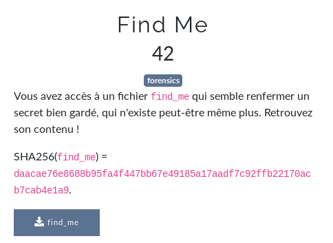

# Find Me



## Methode 1:

```
$ mkdir mnt/
$    mnt/
$ ls -la mnt/
total 25614
drwx------ 2 root root    12288 Apr  1 21:54 lost+found
-rw-r--r-- 1 root root       32 Apr  1 21:54 pass.b64
-rw-r--r-- 1 root root 26214400 Apr  1 22:00 unlock_me
$ file  mnt/unlock_me 
unlock_me: LUKS encrypted file, ver 1 [aes, xts-plain64, sha256] UUID: 220745be-23df-4ef8-bff0-a36ab5cd1eff
$ cryptsetup -v luksDump unlock_me 
LUKS header information for unlock_me

Version:        1
Cipher name:    aes
Cipher mode:    xts-plain64
Hash spec:      sha256
Payload offset: 4096
MK bits:        256
MK digest:      75 e4 b8 97 04 19 23 a4 63 d1 49 28 c7 cf f7 2b c7 63 90 58 
MK salt:        0f 17 e3 60 a9 ae 44 39 6f 85 42 2e 8b 44 06 44 
                85 79 12 a0 df 3a b0 ca 92 66 a4 a1 36 ab 8b 90 
MK iterations:  166124
UUID:           220745be-23df-4ef8-bff0-a36ab5cd1eff

Key Slot 0: ENABLED
        Iterations:             2654290
        Salt:                   7c 0b 14 2d fa c4 78 29 4b 47 5e 3d 22 6e a7 99 
                                31 95 48 fb b3 96 43 09 01 f9 11 9e f0 e8 f4 5f 
        Key material offset:    8
        AF stripes:             4000
Key Slot 1: DISABLED
Key Slot 2: DISABLED
Key Slot 3: DISABLED
Key Slot 4: DISABLED
Key Slot 5: DISABLED
Key Slot 6: DISABLED
Key Slot 7: DISABLED
Command successful.
$ 
```

## Methode 2:

```bash
$ file find_me 
find_me: Linux rev 1.0 ext4 filesystem data, UUID=9c0d2dc5-184c-496a-ba8e-477309e521d9, volume name "find_me" (needs journal recovery) (extents) (64bit) (large files) (huge files)
$  man -f extundelete
extundelete (1)      - utility to undelete files from an ext3 or ext4 partition.
$ extundelete find_me 
No action specified; implying --superblock.
NOTICE: Extended attributes are not restored.
WARNING: EXT3_FEATURE_INCOMPAT_RECOVER is set.
The partition should be unmounted to undelete any files without further data loss.
If the partition is not currently mounted, this message indicates 
it was improperly unmounted, and you should run fsck before continuing.
If you decide to continue, extundelete may overwrite some of the deleted
files and make recovering those files impossible.  You should unmount the
file system and check it with fsck before using extundelete.
Would you like to continue? (y/n) 
y
Inodes count: 7680
Blocks count: 30720
Reserved blocks count: 1536
Free blocks count: 2388
Free inodes count: 7667
First Data Block: 1
Block size: 1024
Fragment size: 1024
# Blocks per group: 8192
# Fragments per group: 1
# Inodes per group: 1920
Mount time: 1585770980
Write time: 1585770980
Mount count: 3
Maximal mount count: -1
Magic signature: 61267
File system state: 1
Behaviour when detecting errors: 1
minor revision level: 0
time of last check: 1585770844
max. time between checks: 0
OS: 0
Revision level: 1
Default uid for reserved blocks: 0
Default gid for reserved blocks: 0
First non-reserved inode: 11
size of inode structure: 128
block group # of this superblock: 0
compatible feature set: 60
incompatible feature set: 710
readonly-compatible feature set: 1131
128-bit uuid for volume: 9c0d2dc5184c496aba8e477309e521d9
For compression: 0
Nr to preallocate for dirs: 0
Per group table for online growth: 239
uuid of journal superblock: 00000000000000000000000000000000
inode number of journal file: 8
device number of journal file: 0
start of list of inodes to delete: 0
HTREE hash seed: 5a66c10604436f0379c96393cfe01c68
Default hash version to use: 1
Default type of journal backup: 1
First metablock group: 0
When the filesystem was created: 1585770844
Compatible feature set: HAS_JOURNAL EXT_ATTR RESIZE_INODE DIR_INDEX
Incompatible feature set: FILETYPE RECOVER
Read only compatible feature set: SPARSE_SUPER LARGE_FILE
$ mkdir ctf_mount
$ mount find_me ctf_mount
$ cd ctf_mount/
$ s -la
total 25619
drwxr-xr-x 3 root root     1024 Apr 26 13:04 .
drwxr-xr-x 1 user user     4096 Apr 26 13:04 ..
drwx------ 2 root root    12288 Apr  1 21:54 lost+found
-rw-r--r-- 1 root root       32 Apr  1 21:54 pass.b64
-rw-r--r-- 1 root root 26214400 Apr  1 22:00 unlock_me
$ cat pass.b64 
nothing here. password splited!
$ file unlock_me 
unlock_me: LUKS encrypted file, ver 1 [aes, xts-plain64, sha256] UUID: 220745be-23df-4ef8-bff0-a36ab5cd1eff
$ aeskeyfind -v unlock_me 
Keyfind progress: 100%
$
```

flag: `FCSC{}`

## Liens utiles

- https://github.com/ctfs/write-ups-2015/tree/master/opentoall-ctf-2015/forensics/gone
- https://github.com/ctfs/write-ups-2015/tree/master/opentoall-ctf-2015/forensics/catz
- https://0xswitch.fr/CTF/ctf-interiut-2018-luks
- https://github.com/jesux/ctf-write-ups/tree/master/cybercamp-quals-2018/07-vacaciones