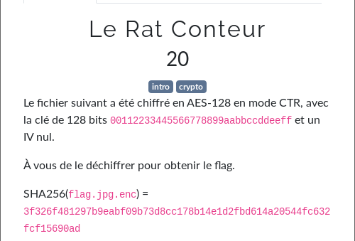
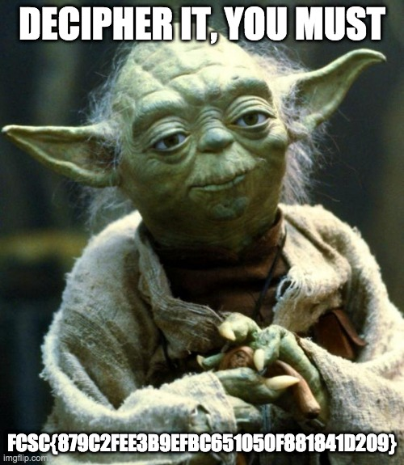

# Le Rat Conteur



```bash
openssl enc -d -aes-128-ctr -in flag.jpg.enc -out flag.jpg -K 00112233445566778899aabbccddeeff -iv 00000000000000000000000000000
```



flag: `FCSC{879C2FEE3B9EFBC651050F881841D209}`

## Lien utile

- https://sandilands.info/sgordon/simple-introduction-to-using-openssl-on-command-line