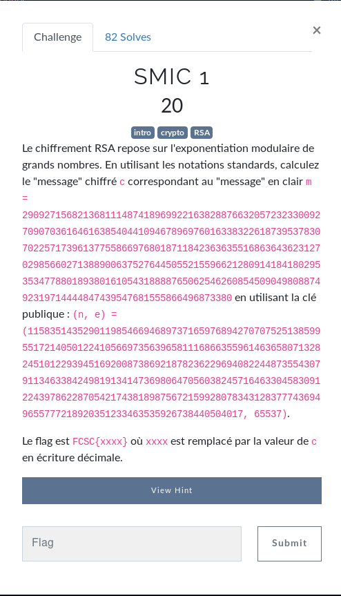
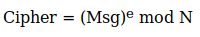

En lisant l'enonce, le `(n, e) = ...` ressemble beaucoup a du **python**.

Puis en allant sur ce [site](https://www.cs.drexel.edu/~jpopyack/IntroCS/HW/RSAWorksheet.html), on trouve la formule suivante:



Par consequent, si on fait le calcul:

```bash
$ python3
Python 3.7.5 (default, Apr 19 2020, 20:18:17) 
[GCC 9.2.1 20191008] on linux
Type "help", "copyright", "credits" or "license" for more information.
>>> m = 29092715682136811148741896992216382887663205723233009270907036164616385404410946789697601633832261873953783070225717396137755866976801871184236363551686364362312702985660271388900637527644505521559662128091418418029535347788018938016105431888876506254626085450904980887492319714444847439547681555866496873380
>>> (n, e) = (115835143529011985466946897371659768942707075251385995517214050122410566973563965811168663559614636580713282451012293945169200873869218782362296940822448735543079113463384249819134147369806470560382457164633045830912243978622870542174381898756721599280783431283777436949655777218920351233463535926738440504017, 65537)
>>> (m ** e) % n
43038584369552603099759673610132404954603129182365447300530480398332322363741719021427218282885888340427764617212360258625034642827465292074914623418386094167402748099928035759712951543068670333972608099203444196434250100760907677561414593941829935308834430903916897564884969367373487895789351212840634163159
>>> 
```

flag: `FCSC{43038584369552603099759673610132404954603129182365447300530480398332322363741719021427218282885888340427764617212360258625034642827465292074914623418386094167402748099928035759712951543068670333972608099203444196434250100760907677561414593941829935308834430903916897564884969367373487895789351212840634163159}`