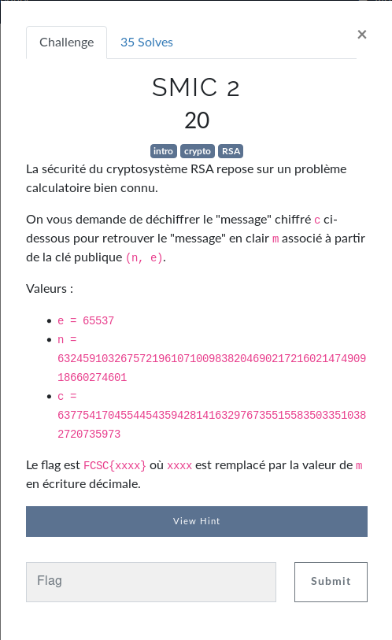
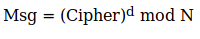

Meme chose que pour **SMIC 1**, en allant sur ce [site](https://www.cs.drexel.edu/~jpopyack/IntroCS/HW/RSAWorksheet.html), on trouve la formule suivante:

## Tentative 1



## Tentative 2

```bash
$ python3 /opt/RsaCtfTool/RsaCtfTool.py -n 632459103267572196107100983820469021721602147490918660274601 -e 65537 --uncipher 63775417045544543594281416329767355155835033510382720735973

[*] Testing key /tmp/tmprp6yt48m.
Can't load qicheng because sage is not installed
Can't load boneh_durfee because sage is not installed
Can't load ecm2 because sage is not installed
Can't load smallfraction because sage is not installed
Can't load ecm because sage is not installed
[*] Performing primefac attack on /tmp/tmprp6yt48m.
[*] Performing comfact_cn attack on /tmp/tmprp6yt48m.
[*] Performing mersenne_primes attack on /tmp/tmprp6yt48m.
[*] Performing smallq attack on /tmp/tmprp6yt48m.
[*] Performing noveltyprimes attack on /tmp/tmprp6yt48m.
[*] Performing partial_q attack on /tmp/tmprp6yt48m.
[*] Performing cube_root attack on /tmp/tmprp6yt48m.
[*] Performing pollard_p_1 attack on /tmp/tmprp6yt48m.
[*] Performing pastctfprimes attack on /tmp/tmprp6yt48m.
[*] Performing factordb attack on /tmp/tmprp6yt48m.

Results for /tmp/tmprp6yt48m:

Unciphered data :
b'Y\xcd?\x8cBo\xf5s*\x1b\xd0\x84\xe5\xa5\x99\xbd\x88\n=\xdd\x86Ho\x7f\x93'
```

## Tentative 3

```bash
$ python3
Python 3.8.2 (default, Apr  1 2020, 15:52:55) 
[GCC 9.3.0] on linux
Type "help", "copyright", "credits" or "license" for more information.
>>> c = 63775417045544543594281416329767355155835033510382720735973
>>> n = 632459103267572196107100983820469021721602147490918660274601
>>> e = 65537
>>> # https://www.alpertron.com.ar/ECM.HTM
>>> p = 650655447295098801102272374367
>>> q =  972033825117160941379425504503
>>> 
>>> p * q
632459103267572196107100983820469021721602147490918660274601
>>> 
>>> 
>>> p * q == n
True
>>> 
>>> (p-1)*(q-1)
632459103267572196107100983818846332449189887748436962395732
>>> phi_n = (p-1)*(q-1)
>>> # https://www.dcode.fr/inverse-modulaire
>>> d = 168419004077477912728094456102758841477383186917096020076145
>>> pow(c,d,n)
563694726501963824567957403529535003815080102246078401707923
>>> m = pow(c,d,n)
>>> pow(m,e,n)
63775417045544543594281416329767355155835033510382720735973
>>> pow(m,e,n) == c
True
```
flag: `FCSC{563694726501963824567957403529535003815080102246078401707923}` ? **Non**

## Liens utiles

- https://asecuritysite.com/encryption/rsac
- https://www.dcode.fr/inverse-modulaire
- https://www.alpertron.com.ar/ECM.HTM
- https://sidsbits.com/RSA-Tool/
- https://medium.com/asecuritysite-when-bob-met-alice/cracking-rsa-a-challenge-generator-2b64c4edb3e7