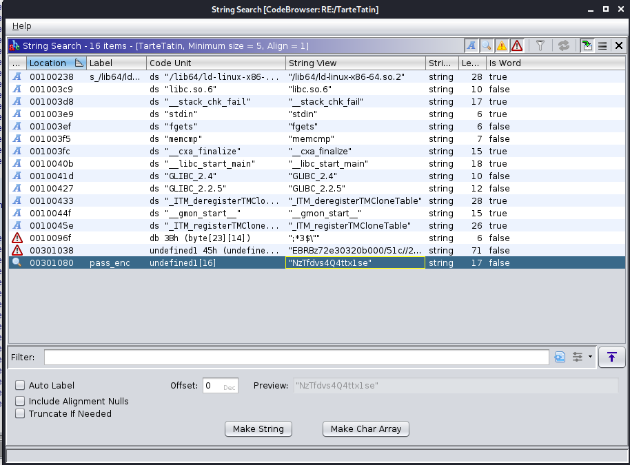

# Tarte Tatin

En desassemblant le fichier binaire via `ghidra` et en allant `Search > For Strings`, on tombe sur la variable suivante:

- `pass_enc=NzTfdvs4Q4ttx1se`

Code du main decompile:

J'ai finalement utilise `gdb` pour sauter l'instruction du `if (iVar1 == 0)`

flag: `FCSC{83f41431c111062d003dd0213cf824d66f770a0be1305e2813f15dd76503a91d}`

## Liens utiles

- https://youtu.be/yQTMvtutsjY
- https://stackoverflow.com/questions/20015203/is-there-a-way-to-get-gdb-to-skip-ignore-an-instruction