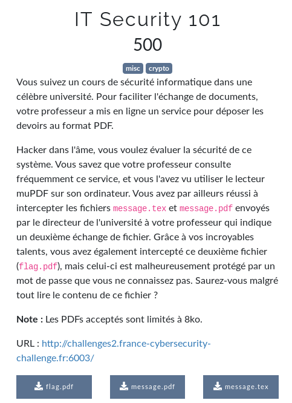

# IT Security 101



```bash

```

flag: `FCSC{}`

## Liens utiles

- https://www.asafety.fr/vuln-exploit-poc/ctf-ndh-2018-quals-write-up-web-linked-out/
- https://0x90r00t.com/2016/02/29/internetwache-ctf-2016-web-90-texmaker-write-up/
- https://github.com/VulnHub/ctf-writeups/blob/master/2016/internetwache/web90.md