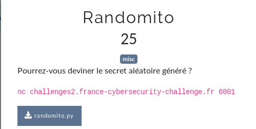

# Randomito



```bash
$ nc challenges2.france-cybersecurity-challenge.fr 6001
[+] Generating a 128-bit random secret (a, b)
[+] Done! Now, try go guess it!
>>> a = secret_a
>>> b = secret_b
[-] Trying df81a5b1229f146b44013f7a646509da
[+] Well done! Here is the flag: FCSC{4496d11d19db92ae53e0b9e9415d99d877ebeaeab99e9e875ac346c73e8aca77}
```

flag: `FCSC{4496d11d19db92ae53e0b9e9415d99d877ebeaeab99e9e875ac346c73e8aca77}`

## Liens utiles

- https://intx0x80.blogspot.com/2017/05/python-input-vulnerability_25.html