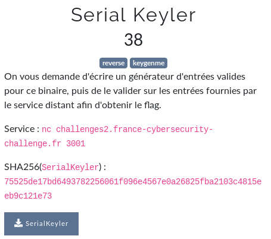

# Serial Keyler



```bash
$ nc challenges2.france-cybersecurity-challenge.fr 3001
What is a valid serial for username: ecsc
>>>
```

Un **XOR 31** avec chacune des lettres du `param1` semble etre realise:


```bash
$ trace ./SerialKeyler 
printf("[+] Username: ")                                                                                                                         = 14
__isoc99_scanf(0x560d37eeca57, 0x7ffe196c1060, 0, 0[+] Username: a
)                                                                                             = 1
printf("[+] Serial:   ")                                                                                                                         = 14
__isoc99_scanf(0x560d37eeca57, 0x7ffe196c10a0, 0, 0[+] Serial:   a
)                                                                                             = 1
strlen("a")                                                                                                                                      = 1
memset(0x7ffe196c1000, '\0', 64)                                                                                                                 = 0x7ffe196c1000
strcmp("a", "~")                                                                                                                                 = -29
puts("[!] Incorrect serial."[!] Incorrect serial.
)                                                                                                                    = 22
+++ exited (status 0) +++
```

On remarque le `strcmp("a", "~")`, or `~` est au caractere `a` l'equivalent en **python** de : `chr(ord('a') ^ 31)`. Ainsi:

```bash
$ ltrace ./SerialKeyler 
printf("[+] Username: ")                                                                                                                         = 14
__isoc99_scanf(0x55fef4215a57, 0x7fffb366e870, 0, 0[+] Username: a
)                                                                                             = 1
printf("[+] Serial:   ")                                                                                                                         = 14
__isoc99_scanf(0x55fef4215a57, 0x7fffb366e8b0, 0, 0[+] Serial:   ~
)                                                                                             = 1
strlen("a")                                                                                                                                      = 1
memset(0x7fffb366e810, '\0', 64)                                                                                                                 = 0x7fffb366e810
strcmp("~", "~")                                                                                                                                 = 0
puts("[>] Valid serial!"[>] Valid serial!
)                                                                                                                        = 18
puts("[>] Now connect to the remote se"...[>] Now connect to the remote server and generate serials for the given usernames.
)                                                                                                      = 83
+++ exited (status 0) +++
```

```bash
$ ltrace ./SerialKeyler 
printf("[+] Username: ")                                                                                                                         = 14
__isoc99_scanf(0x563e94dd8a57, 0x7ffe6cb6a770, 0, 0[+] Username: ecsc
)                                                                                             = 1
printf("[+] Serial:   ")                                                                                                                         = 14
__isoc99_scanf(0x563e94dd8a57, 0x7ffe6cb6a7b0, 0, 0[+] Serial:   ecsc
)                                                                                             = 1
strlen("ecsc")                                                                                                                                   = 4
memset(0x7ffe6cb6a710, '\0', 64)                                                                                                                 = 0x7ffe6cb6a710
strcmp("ecsc", "|l|z")                                                                                                                           = -23
puts("[!] Incorrect serial."[!] Incorrect serial.
)                                                                                                                    = 22
+++ exited (status 0) +++
$ ltrace ./SerialKeyler 
printf("[+] Username: ")                                                                                                                         = 14
__isoc99_scanf(0x56151cdafa57, 0x7fff02d30c40, 0, 0[+] Username: ecsc
)                                                                                             = 1
printf("[+] Serial:   ")                                                                                                                         = 14
__isoc99_scanf(0x56151cdafa57, 0x7fff02d30c80, 0, 0[+] Serial:   |l|z    
)                                                                                             = 1
strlen("ecsc")                                                                                                                                   = 4
memset(0x7fff02d30be0, '\0', 64)                                                                                                                 = 0x7fff02d30be0
strcmp("|l|z", "|l|z")                                                                                                                           = 0
puts("[>] Valid serial!"[>] Valid serial!
)                                                                                                                        = 18
puts("[>] Now connect to the remote se"...[>] Now connect to the remote server and generate serials for the given usernames.
)                                                                                                      = 83
+++ exited (status 0) +++
$ 
```

`|l|z` est a `ecsc` l'equivalent en **python** de `"".join([ chr(ord(c)^31) for c in 'ecsc'])[::-1]`

Automatisons tout cela avec un petit script:

```python
import pwn

remote = True
if remote:
    io = pwn.remote('challenges2.france-cybersecurity-challenge.fr', 3001)
else:
    io = pwn.process(elf.path)

pwn.context.log_level = 'debug'

while True:
    try:
        r = io.recvuntil('What is a valid serial for username: ')
    except:
        break
    word = io.recvline().strip()
    answer = "".join([ chr(ord(c)^31) for c in word])[::-1]
    io.sendline(answer)
io.close()
```

flag: `FCSC{8f1018d0cfe395018a1c90dbff352e2ba4a6261336fb7c32454cdae4974d4333}`

## Liens utiles

- https://github.com/Gallopsled/pwntools-tutorial/blob/master/tubes.md