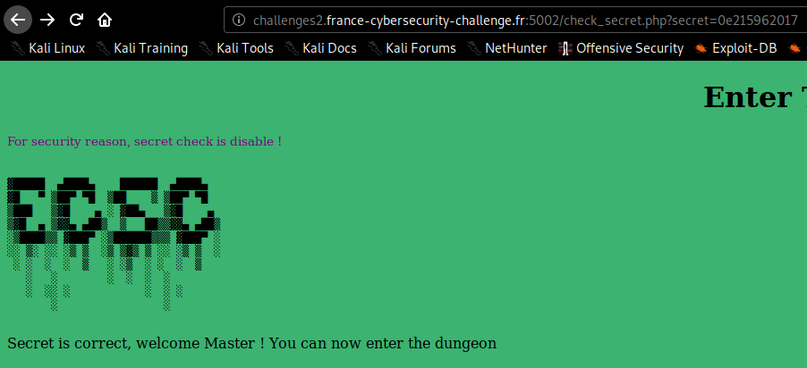

# Enter The Dungeon

`http://challenges2.france-cybersecurity-challenge.fr:5002/check_secret.php?secret=0e215962017`

flag: `FCSC{f67aaeb3b15152b216cb1addbf0236c66f9d81c4487c4db813c1de8603bb2b5b}`

## Liens utiles

- https://crypto.stackexchange.com/questions/19493/is-there-a-string-thats-hash-is-equal-to-itself
- https://jaimelightfoot.com/blog/b00t2root-ctf-easyphp/
- https://github.com/swisskyrepo/PayloadsAllTheThings/tree/master/Type%20Juggling
- http://sandbox.onlinephpfunctions.com/