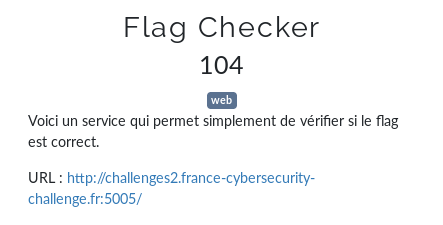
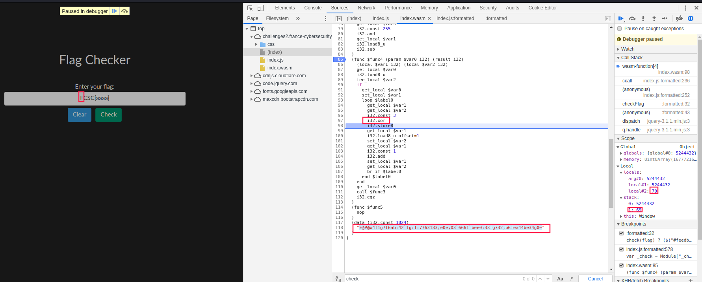

# Flag Checker




Merci cet [article](https://anee.me/reversing-web-assembly-wasm-dd59eb2a52d4)!



```bash
python
Python 2.7.18rc1 (default, Apr  7 2020, 12:05:55) 
[GCC 9.3.0] on linux2
Type "help", "copyright", "credits" or "license" for more information.
>>> [ord(c) for c in "E@P@x4f1g7f6ab:42`1g:f:7763133;e0e;03`6661`bee0:33fg732;b6fea44be34g0~"]
[69, 64, 80, 64, 120, 52, 102, 49, 103, 55, 102, 54, 97, 98, 58, 52, 50, 96, 49, 103, 58, 102, 58, 55, 55, 54, 51, 49, 51, 51, 59, 101, 48, 101, 59, 48, 51, 96, 54, 54, 54, 49, 96, 98, 101, 101, 48, 58, 51, 51, 102, 103, 55, 51, 50, 59, 98, 54, 102, 101, 97, 52, 52, 98, 101, 51, 52, 103, 48, 126]
>>> [chr(ord(c) ^ 3) for c in "E@P@x4f1g7f6ab:42`1g:f:7763133;e0e;03`6661`bee0:33fg732;b6fea44be34g0~"]
['F', 'C', 'S', 'C', '{', '7', 'e', '2', 'd', '4', 'e', '5', 'b', 'a', '9', '7', '1', 'c', '2', 'd', '9', 'e', '9', '4', '4', '5', '0', '2', '0', '0', '8', 'f', '3', 'f', '8', '3', '0', 'c', '5', '5', '5', '2', 'c', 'a', 'f', 'f', '3', '9', '0', '0', 'e', 'd', '4', '0', '1', '8', 'a', '5', 'e', 'f', 'b', '7', '7', 'a', 'f', '0', '7', 'd', '3', '}']
>>> "".join([chr(ord(c) ^ 3) for c in "E@P@x4f1g7f6ab:42`1g:f:7763133;e0e;03`6661`bee0:33fg732;b6fea44be34g0~"])
'FCSC{7e2d4e5ba971c2d9e944502008f3f830c5552caff3900ed4018a5efb77af07d3}'
>>> 
```

flag: `FCSC{7e2d4e5ba971c2d9e944502008f3f830c5552caff3900ed4018a5efb77af07d3}`

## Liens utiles

- https://anee.me/reversing-web-assembly-wasm-dd59eb2a52d4
- https://rsms.me/wasm-intro
- https://github.com/RadjahDri/WriteUp/blob/master/QualsNDH18%20-%20AssemblyMe.md
- https://tipi-hack.github.io/2018/04/01/quals-NDH-18-assemblyme.html
- https://github.com/athre0z/wasm
- https://github.com/WebAssembly/wabt/tree/master/wasm2c