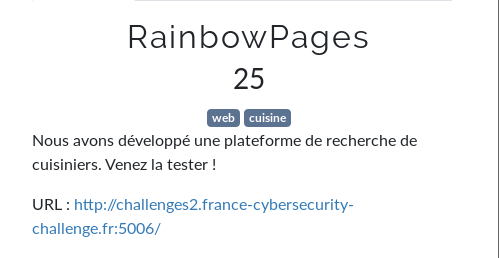

# RainbowPages v2



- `"`:
  ```json
  {"errors":[{"message":"Syntax Error: Cannot parse the unexpected character \"%\".","locations":[{"line":1,"column":52}]}]}
  ```

- `"__schema"`:

  ```json
  {"errors":[{"message":"Syntax Error: Expected :, found String \"%\"","locations":[{"line":1,"column":60}]}]}
  ```

- `"}}#`

  ```json

  ```

