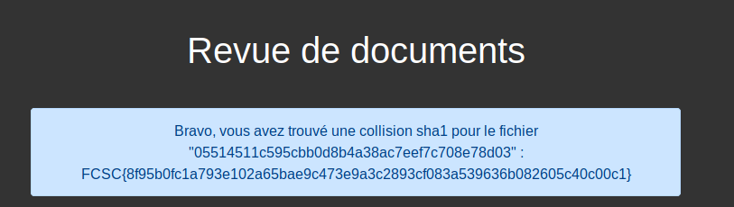

# Revision

**Objectif**: donner deux fichiers differents avec le meme hash SHA-1. Possible via [SHA1 collider](http://alf.nu/SHA1)

Fichiers:

Image A         | Image B        |
----------------|----------------|
 | 

flag: `FCSC{8f95b0fc1a793e102a65bae9c473e9a3c2893cf083a539636b082605c40c00c1}   `

- http://alf.nu/SHA1
- https://github.com/nneonneo/sha1collider
- https://www.linformaticien.com/actualites/id/43271/sha1-google-provoque-une-collision-et-signe-l-arret-de-mort-de-la-fonction.aspx